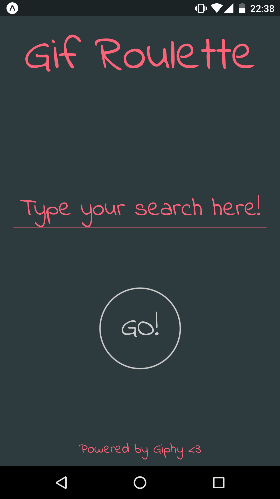
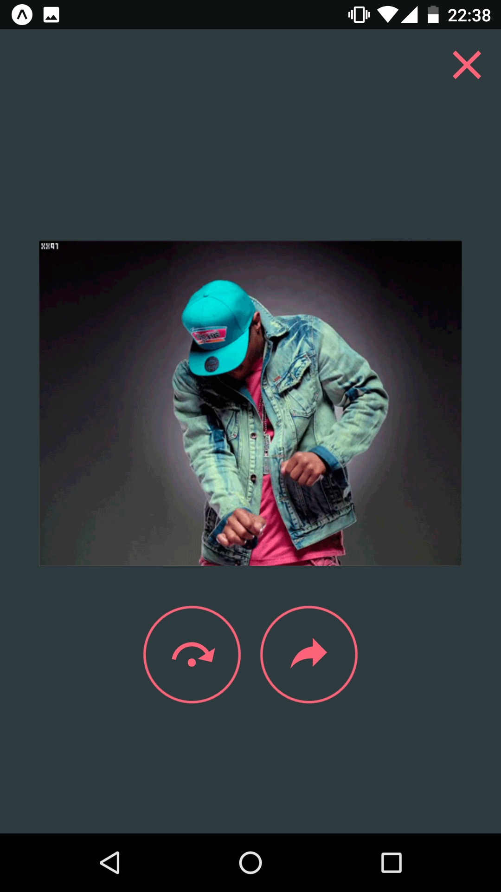
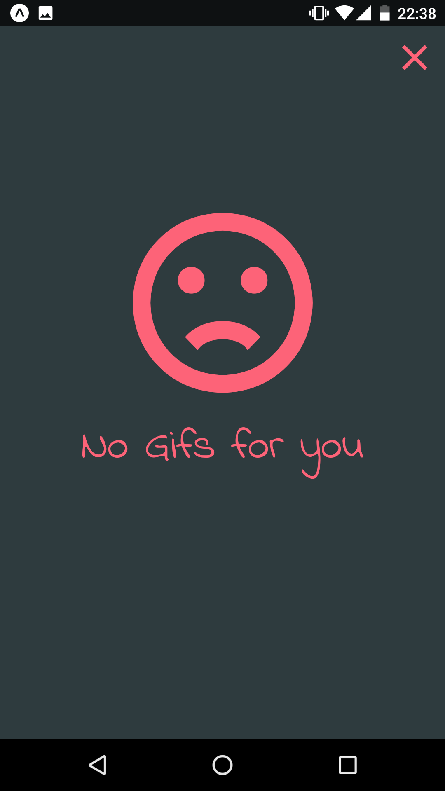

    
    
    

# Gif Roulette

React Native app that you can search gifs by a term, shuffle it and share with your friends. :hankey:

This app was built using Expo.

## Expo Link

https://expo.io/@jouderianjr/gifroulette

## Disclaimer

Hey, this is my second attempt with React Native (The first one is [here](https://github.com/jouderianjr/giphyStickers)), so I my still learning and improving my react skills (I'm a beginner), feel free to give me some feedbacks :heart:

## Next Steps

- Add Tests :sweat_smile:
- Show a loading indicator when the Gif is loading :alien:
- Fix minor issues.
